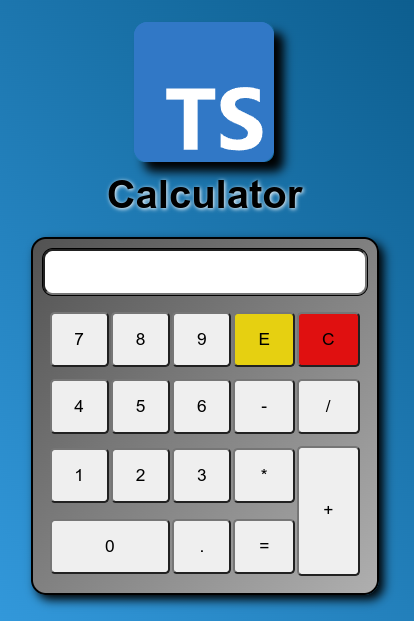

<div align="center" style="border-radius: 20px;"></div>

<div align="center"><h1>Typescript Calculator</h1></div>

<div align="center">A simple calculator with logic built entirely in Typescript for practice.</div>

***

You can run the project on your machine by cloning the project with:
```
git clone https://github.com/willypedroso/ts-calculator
```

Then you have to resolve the dependencies:
```
cd ts-calculator
```
```
npm i
```

And start the project:
```
npm run start
```